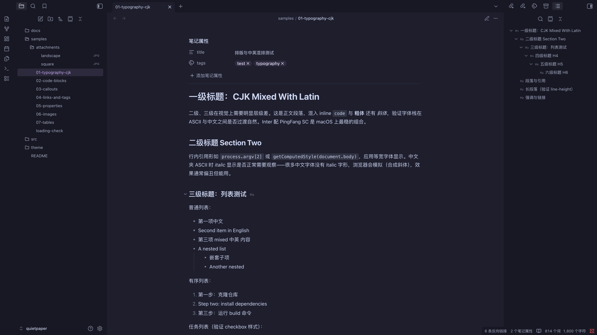

# 主题包 (Quietpaper)

Quietpaper 是基于 Catppuccin 配色的 Obsidian 主题，使用原生 CSS 和 Bun 构建。包内维护配色、笔记排版和界面样式，生成 Obsidian 可加载的 `theme.css` 与 `manifest.json`。



## 工程位置

本包独立使用 `package.json` 与 `bun.lock`，不属于 Python uv workspace。运行环境为 Bun ≥ 1.3；依赖只用于开发和构建，Obsidian 加载生成的 CSS，不运行 Bun。

| 路径 | 职责 |
|---|---|
| `build.ts` | 配色生成、CSS 构建、监听及显式部署 |
| `src/tokens/` | Catppuccin 配色与强调色；`generated.css` 由命令生成 |
| `src/base/` | 全局变量、排版、打印和响应式规则 |
| `src/content/` | 笔记正文元素 |
| `src/ui/` | 导航、面板和设置界面 |
| `theme/` | 受版本控制的主题产物与主题信息 |
| `samples/` | 上游样本及图片，用于人工检查显示效果 |
| `tests/` | 构建路径、部署写集和失败行为的 CLI 测试 |
| `upstream.json` | 导入提交、上游文件摘要与未导入文件 |

## 构建命令

从仓库根目录安装锁定依赖并构建：

```bash
cd packages/quietpaper
bun install --frozen-lockfile --ignore-scripts
bun run build
bun run test
```

也可从仓库根直接运行 `bun packages/quietpaper/build.ts build`。构建输入和输出均相对于包目录定位；调用位置不改变写入位置。

`bun run tokens` 只生成配色，`bun run dev` 监听源码并生成未压缩 CSS。开发监听不部署主题；修改 `build.ts` 的构建逻辑后需重启监听进程。

## 主题部署

目标必须是已存在且包含 `.obsidian/` 目录的知识库。每次部署显式指定一个目标，没有默认目标：

```bash
bun packages/quietpaper/build.ts deploy --vault /absolute/path/to/test-vault
```

`deploy` 先构建，成功后复制；`sync --vault /absolute/path/to/test-vault` 只复制当前 `theme/` 产物，不判断它们是否对应最新源码。日常更新建议使用 `deploy`。相对目标路径按调用命令的当前目录解释。

写集仅为目标的 `.obsidian/themes/quietpaper/theme.css` 与 `manifest.json`，必要时创建父目录；既有同名主题文件会被替换。命令保留文章、其他主题和外观配置，不自动选择主题或重载 Obsidian。目标配置目录、主题目录和主题文件若为符号链接则拒绝部署，避免重定向写入。

缺少参数、目标无效、构建失败或源产物缺失时返回非零状态。两个主题文件分别写入，不承诺中断时的整体原子替换；恢复时可重新部署已知版本。

首次安装后，在 Obsidian 外观设置中选择 quietpaper。正式库的安装和启用属于单独的应用操作。

## 样式维护

在 `src/base/`、`src/content/` 或 `src/ui/` 中修改对应样式。主题内部配色使用 CSS layer，覆盖 Obsidian 的规则沿用上游层级；不要仅因包内没有引用而删除对外可用的 `--ctp-*` 变量。

强调色由 `src/tokens/accent.css` 指定；深浅配色在 `build.ts` 中选择。修改后重新构建，连同 `src/tokens/generated.css` 和 `theme/theme.css` 一起审阅。

链接统一使用主题强调色：已存在内链为普通文字，外链采用两条细线，悬停仅加深较淡的一条，不改变尺寸或添加背景；未创建内链使用弱化强调色和虚线。阅读视图与实时预览分别适配，装饰随长链接换行，并遵循系统减少动态效果设置。

## 显示样本

`samples/` 包含混合排版、代码、提示框、链接、属性、图片和表格。文件保留上游演示内容，标题及内部标题链接按仓库写作约定调整；演示文字和故意失效的链接不作为项目设计依据或正式知识内容。

显示检查应使用单独的临时开发库，复制样本后显式部署主题，再通过 Obsidian CLI 检查加载与页面。构建和自动测试不能代替深浅主题、不同窗口宽度及阅读模式下的人工视觉检查。

## 上游来源

导入自 [oNo500/quietpaper](https://github.com/oNo500/quietpaper)，固定提交为 [42b29a545600e9ee538cfd9e8db1ef788658dbb5](https://github.com/oNo500/quietpaper/tree/42b29a545600e9ee538cfd9e8db1ef788658dbb5)。作者与主题版本沿用上游 manifest；这是源码导入，不是新版本发布。

该提交未提供许可证文件，本包不自行授予许可证。原 `.claude/CLAUDE.md` 含自动部署至旧库等代理指令，未作为当前包指令导入；其原文件摘要保存在 `upstream.json`，维护时可按固定提交查阅。

后续上游更新需明确新提交并审阅差异，不自动覆盖本包改动。依赖版本继续由本包锁文件固定，不引入根级 JavaScript workspace。
